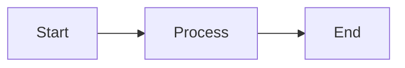
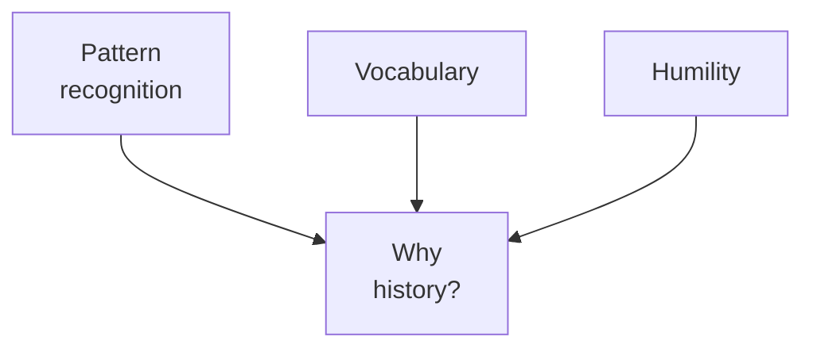
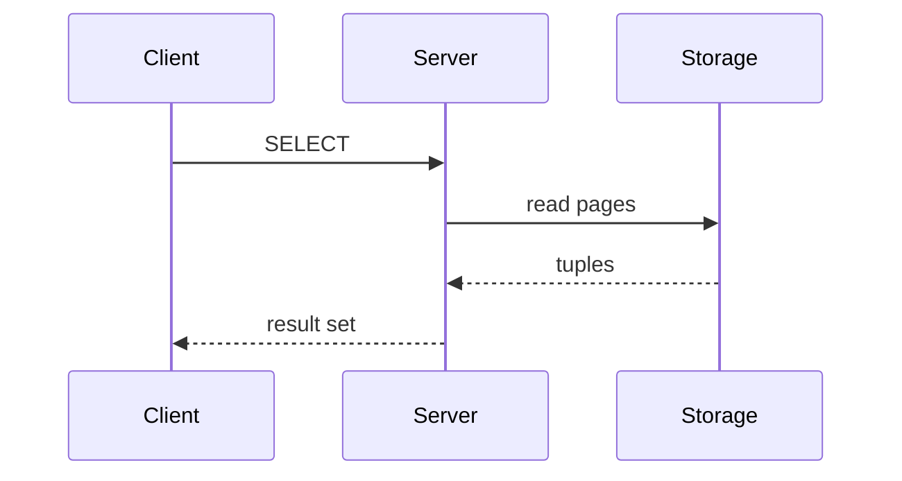

# Mermaid test

```mermaid
graph LR
  A["Start"] --> B["Process"] --> C["End"]
```

---

# Labels with line breaks

```mermaid
graph TB
  P["Pattern<br/>recognition"] --> WHY["Why<br/>history?"]
  V["Vocabulary"] --> WHY
  H["Humility"] --> WHY
```

---

# A sequence diagram

```mermaid
sequenceDiagram
  Client->>Server: SELECT
  Server->>Storage: read pages
  Storage-->>Server: tuples
  Server-->>Client: result set
```
