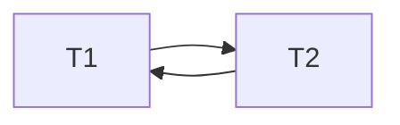
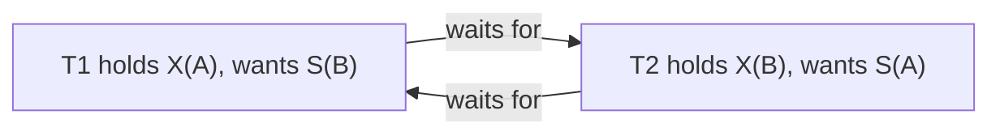
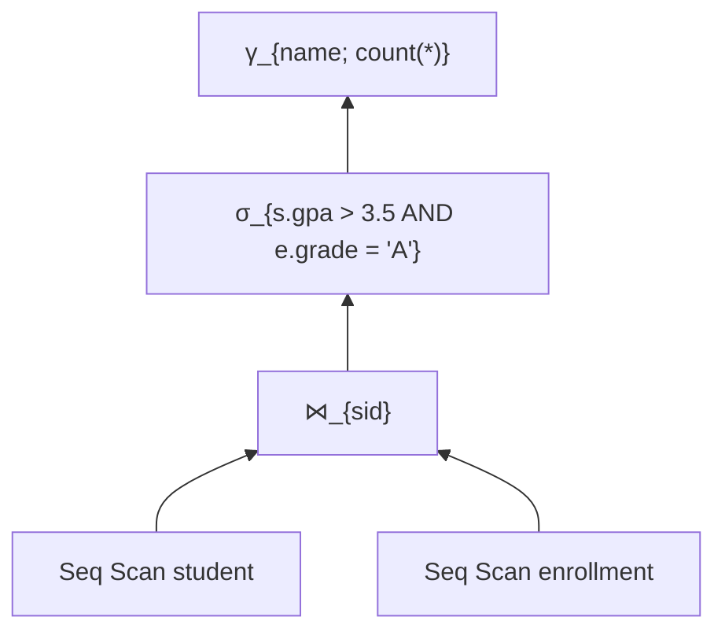
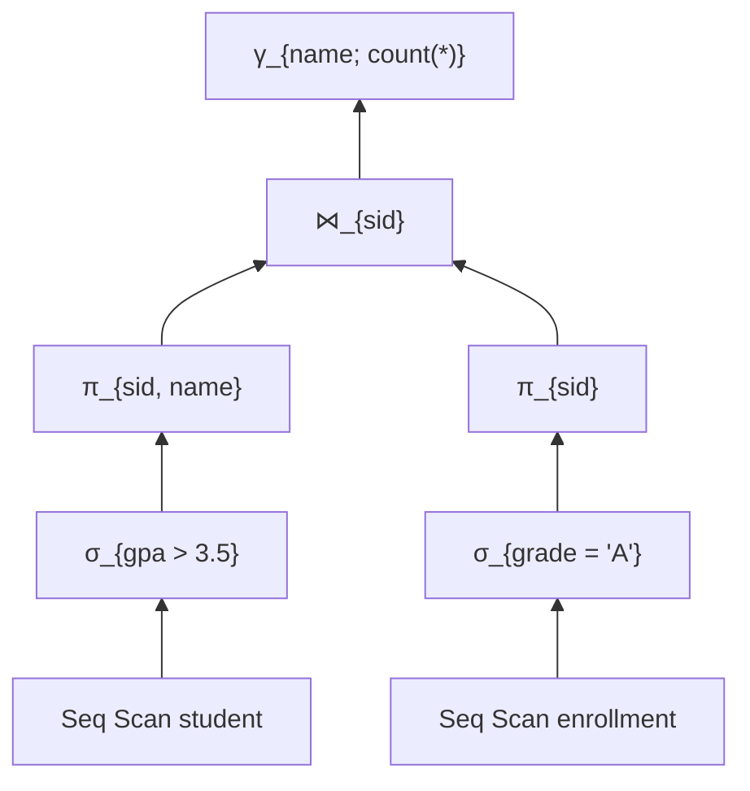

# Final Exam Practice Packet — Solutions

Solutions for [`exam3-final.md`](exam3-final). Cumulative across all seven sections.

---

## Problem 1 — ACID and Anomalies

**ACID:**

- **Atomicity** — A transaction's operations either all complete or none take effect; partial work is rolled back on failure.
- **Consistency** — A transaction takes the database from one valid state (satisfying all constraints and invariants) to another valid state.
- **Isolation** — Concurrent transactions appear to execute in some sequential order; one transaction's intermediate state is not visible to others.
- **Durability** — Once a transaction commits, its changes survive crashes — they are persisted to non-volatile storage before commit returns.

**Anomalies → lowest PostgreSQL isolation level that prevents:**

| Anomaly | Lowest level |
|---------|--------------|
| Dirty read | `READ COMMITTED` (the default) |
| Lost update | `READ COMMITTED` (via row locks on UPDATE) |
| Non-repeatable read | `REPEATABLE READ` |
| Phantom read | `REPEATABLE READ` (PostgreSQL-specific; SQL standard requires `SERIALIZABLE`) |
| Write skew | `SERIALIZABLE` (PostgreSQL uses Serializable Snapshot Isolation, SSI) |

PostgreSQL never exposes true `READ UNCOMMITTED`; setting that level silently behaves as `READ COMMITTED`.

---

## Problem 2 — MVCC True/False

1. *"PostgreSQL's UPDATE modifies the tuple in place."* — **FALSE.** Every UPDATE writes a new tuple version with a new `xmin`; the old tuple's `xmax` is set, and it remains on disk until VACUUM removes it.

2. *"After DELETE, the row is immediately removed from disk."* — **FALSE.** DELETE marks the tuple's `xmax`. The physical row stays on disk until VACUUM reclaims it.

3. *"A reader in PostgreSQL never blocks waiting on a writer holding an X lock on a row."* — **TRUE.** MVCC's whole point: readers see consistent snapshots without taking locks. They read the version visible to their transaction's snapshot.

4. *"VACUUM FULL requires an exclusive lock on the table."* — **TRUE.** `VACUUM FULL` rewrites the table to a new file; it takes `ACCESS EXCLUSIVE` and blocks all reads and writes during the rewrite. Regular `VACUUM` does not.

5. *"Snapshot isolation prevents all anomalies."* — **FALSE.** Snapshot isolation prevents dirty reads, non-repeatable reads, and phantom reads (in PostgreSQL). It does NOT prevent **write skew**. Only `SERIALIZABLE` (SSI) does.

---

## Problem 3 — Conflict Serializability

Schedule:

```
T1: r(A)            w(B)
T2:       w(A) r(B)
```

**Conflicts identified by item:**

- A: T1.r(A) precedes T2.w(A) → edge T1 → T2
- B: T2.r(B) precedes T1.w(B) → edge T2 → T1

**Conflict graph:**



**Result:** the graph contains a cycle (T1 ↔ T2). The schedule is **NOT conflict serializable**.

There is no serial schedule equivalent to this interleaving: T1-then-T2 would give T1's `r(A)` the value before T2's write (matching), but then T1's `w(B)` would precede T2's `r(B)` — opposite of what happened here. T2-then-T1 has the opposite mismatch. Neither serial order matches.

---

## Problem 4 — Deadlock

**Wait-for graph:**



A cycle T1 → T2 → T1.

**PostgreSQL's response:**

1. After the `deadlock_timeout` (default **1 second**), PostgreSQL's deadlock detector runs.
2. It builds the wait-for graph, detects the cycle.
3. It picks a **victim** transaction (heuristically — usually the one that has done less work or been chosen as victim less often).
4. It aborts the victim with:

```
ERROR:  deadlock detected
DETAIL: Process <pid> waits for ShareLock on transaction <xid>; blocked by process <pid>.
        Process <pid> waits for ShareLock on transaction <xid>; blocked by process <pid>.
HINT:   See server log for query details.
```

5. The non-victim transaction continues. The aborted transaction's connection sees the error; the application is expected to retry.

---

## Problem 5 — ARIES Recovery

Log:

```
LSN  TX     Type     Table  Old   New
100  T1     UPDATE   acc    100   200
105  T1     COMMIT
110  T2     UPDATE   acc    200   150
115  CHECKPOINT
120  T2     UPDATE   acc    150   80
125  T3     UPDATE   acc    80    60
```

Crash after LSN 125. No commits beyond LSN 105.

**1. Committed vs not.**

- **T1: committed** (COMMIT at LSN 105).
- **T2: not committed** (no COMMIT in log).
- **T3: not committed** (no COMMIT in log).

**2. After redo phase.**

Redo replays all log records from the checkpoint forward, applying every change to disk if it isn't already there. Starting from the table state at the checkpoint (which had T1's commit and T2's first update applied):

- LSN 110 redone: `acc = 150`
- LSN 120 redone: `acc = 80`
- LSN 125 redone: `acc = 60`

**After redo: `acc = 60`** (the value at crash time).

**3. After undo phase.**

Undo walks backward through the log for uncommitted transactions (T2 and T3), reversing their changes and writing **compensation log records (CLRs)**:

- Undo T3's LSN 125: revert from 60 → 80 (CLR written)
- Undo T2's LSN 120: revert from 80 → 150 (CLR)
- Undo T2's LSN 110: revert from 150 → 200 (CLR)

T1's update is **not** undone because T1 committed.

**After undo: `acc = 200`** (the value T1 left it at, which is the correct durable state).

---

## Problem 6 — Index Selection

Same as Exam 2 Problem 3 for a 10M-row table:

| Column | Best index | Why |
|--------|-----------|-----|
| `user_id BIGINT`, equality only | **hash** or **btree** | O(1) on hash; btree also good and supports ranges if needed |
| `created_at TIMESTAMPTZ`, append-only | **BRIN** | Correlation between physical order and value; tiny index |
| `tags TEXT[]`, contains queries | **GIN** | Inverts the array into per-element posting lists |
| `email TEXT`, `lower(email)` lookups | **Expression btree** on `lower(email)` | Optimizer uses expression index when query matches |
| `is_active BOOLEAN`, 99% inactive | **Partial btree** `WHERE is_active = true` | Index only the rare-value rows; 99× smaller |

---

## Problem 7 — Join Algorithms

`users`: 1M rows, 50 MB. `orders`: 100M rows, 50 GB. `work_mem = 256 MB`. Both have btree on `user_id`.

Query: `SELECT u.name, o.total FROM users u JOIN orders o USING (user_id) WHERE u.country = 'US'`.

**1. Algorithm chosen.** Depends on the filter selectivity. The 50 MB `users` table easily fits in 256 MB `work_mem`. Two plausible plans:

- If `users.country = 'US'` selects a small fraction (say < 10K rows): **Index nested loop** — for each filtered user, look up orders via the btree index.
- If `users.country = 'US'` selects a large fraction (most of users): **Hash join** with `users` (filtered) as the build side and `orders` as the probe.

PostgreSQL will pick based on cardinality estimates.

**2. Dominant cost.**

- **Index NL:** filtered_users × (4 index reads + ~5 heap reads per match) — dominated by **orders heap fetches**.
- **Hash join:** scan orders once (~6.25M pages) + build hash on filtered users (cheap). Dominated by the **orders sequential scan** (~50 GB read).

**3. If `users.country = 'US'` matches 200,000 rows.**

200K is 20% of 1M users. The optimizer will likely switch to **hash join**: 200K outer × ~10 page reads per lookup = 2M page reads for INL, vs ~6.25M page reads for a sequential scan of orders. Close but INL probably wins.

If matches were 500K (50%), hash join would clearly win because the sequential scan amortizes better than 5M random heap fetches.

This problem illustrates Leis 2015's central finding: **cardinality estimation drives plan choice**, and the wrong estimate can cause the optimizer to pick the wrong algorithm.

---

## Problem 8 — Optimization

Query:

```sql
SELECT s.name, count(*)
FROM   student s
JOIN   enrollment e ON e.sid = s.sid
WHERE  s.gpa > 3.5 AND e.grade = 'A'
GROUP BY s.name;
```

**1. Logical plan tree (no rewrites):**



**2. After selection pushdown and projection pushdown:**



Each filter moves down past the join — onto the relation it constrains. Each projection drops columns the join doesn't need.

**3. One further equivalence the optimizer might apply.**

- **Index choice:** use a btree index on `enrollment.sid` for an index nested loop, or on `student.gpa` for a range scan.
- **Hash aggregate:** the GROUP BY can use hash aggregation if `name` distinct count is small relative to memory.
- **Sort-then-merge:** if there's already a sort on `sid` from an index, sort-merge join skips the hash step.

Any of these earns full credit.

---

## Problem 9 — Advanced SQL

**1. Top-3 students by GPA per major, ties broken alphabetically.**

```sql
SELECT name, major, gpa
FROM (
  SELECT name, major, gpa,
         row_number() OVER (PARTITION BY major ORDER BY gpa DESC, name ASC) AS rk
  FROM   student
) ranked
WHERE rk <= 3
ORDER BY major, rk;
```

**2. 7-day moving average of daily enrollments.**

```sql
SELECT
  enrollment_date,
  count(*) AS daily,
  avg(count(*)) OVER (
    ORDER BY enrollment_date
    ROWS BETWEEN 6 PRECEDING AND CURRENT ROW
  ) AS ma_7d
FROM   enrollment
GROUP BY enrollment_date
ORDER BY enrollment_date;
```

**3. Transitive reports to "Dr. Provost".**

```sql
WITH RECURSIVE subtree AS (
  SELECT fid, name, supervisor_id
  FROM   faculty
  WHERE  name = 'Dr. Provost'

  UNION ALL

  SELECT f.fid, f.name, f.supervisor_id
  FROM   faculty f
  JOIN   subtree s ON f.supervisor_id = s.fid
)
SELECT fid, name
FROM   subtree
WHERE  name <> 'Dr. Provost'    -- exclude the root if desired
ORDER BY name;
```

---

## Problem 10 — Storage

Row size 250 bytes, page 8 KB, page overhead 100 bytes, 50M rows.

**1. Pages.**

Usable per page: $8192 - 100 = 8092$ bytes.
Rows per page: $\lfloor 8092 / 250 \rfloor = 32$ rows.
Total pages: $\lceil 50{,}000{,}000 / 32 \rceil = 1{,}562{,}500$ pages.

Table size: ~12 GB.

**2. Index height.**

Btree on `sid` (8 bytes), fan-out 250.

$$h = \lceil \log_{250} 50{,}000{,}000 \rceil = \lceil 3.21 \rceil = 4$$

So 4 levels (root + 2 internal + leaves).

**3. Point lookup via index.**

Walk the tree: 4 page reads (root + 2 internal + leaf).
Fetch the row from the heap: 1 more page read.

**5 total page reads** per equality lookup.

---

## Problem 11 — Featured Papers

**1. Codd 1970 — *A Relational Model of Data for Large Shared Data Banks*.**
The relational model separates the logical schema (relations as sets of tuples) from physical storage, freeing applications from depending on file layouts.

**2. Selinger 1979 — *Access Path Selection in a Relational Database Management System*.**
A cost-based query optimizer using dynamic programming over subsets of relations, considering interesting orders, is feasible and produces near-optimal plans.

**3. Mohan 1992 — *ARIES*.**
A three-phase recovery algorithm (analysis, redo, undo) using write-ahead logging with LSN-tagged pages and compensation log records makes crash recovery safe, idempotent, and compatible with fine-grained locking.

**4. Stonebraker 2005 — *C-Store: A Column-oriented DBMS*.**
For analytical workloads, a column store with multiple sorted projections, heavy compression, vectorized execution, and a separate write store outperforms general-purpose row stores by 10-100×.

**5. Leis 2015 — *How Good Are Query Optimizers, Really?*.**
Cardinality estimation errors of 10-1000× are common across all major optimizers; getting the **join order** right matters more than getting the cost model right.

**6. Raasveldt & Mühleisen 2019 — *DuckDB: An Embeddable Analytical Database*.**
An OLAP-focused in-process database — columnar, vectorized, single binary, no server — fills the "SQLite for analytics" niche that the data-science ecosystem needed.

---

## Problem 12 — Open-Ended Design: Real-Time Sports Analytics

A defensible 150-word sketch (yours need not match — many architectures earn full credit):

> **Ingest:** 50K events/sec lands in a **streaming buffer** (Kafka or Redpanda) for back-pressure tolerance. A consumer writes to **PostgreSQL** with batched COPY into a partitioned events table — daily partitions, with the current partition kept on fast SSD. Use `synchronous_commit = off` on the ingest path; events tolerate the (tiny) durability window.
>
> **Hot reads (last 30 days):** **DuckDB** reads daily Parquet files exported nightly from PostgreSQL — or directly from a Postgres replica via the `postgres` extension. Materialized views in PostgreSQL cache per-game summaries refreshed every second.
>
> **Dashboard freshness:** PostgreSQL **logical replication** to a read replica isolates dashboards from ingest. Subscriber refreshes the matview on commit.
>
> **Archive (10 years):** nightly export to Parquet on S3, queried via DuckDB or Iceberg-aware engines as needed. Cold data, infinite shelf life.
>
> **Isolation:** `READ COMMITTED` for dashboards (snapshot is consistent enough). Ingest writes are independent; no cross-row invariants.

Alternative architectures (Postgres + ClickHouse, Apache Druid, BigQuery, etc.) are equally valid. The rubric rewards: a clear ingest path, a hot/cold storage split, an isolation choice with justification, and an archive strategy.

---

[back to exam](exam3-final) · [back to course](../index)
